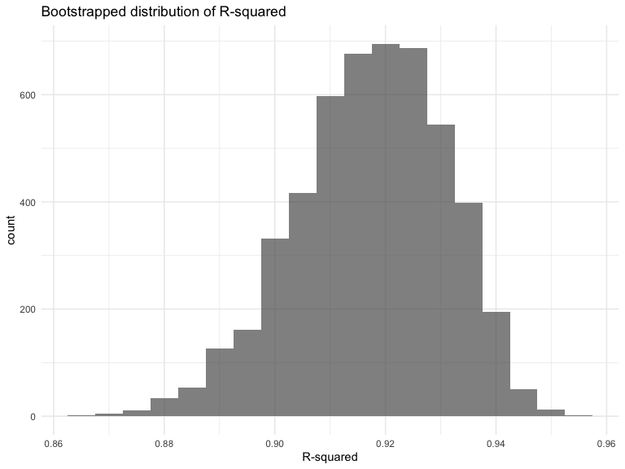
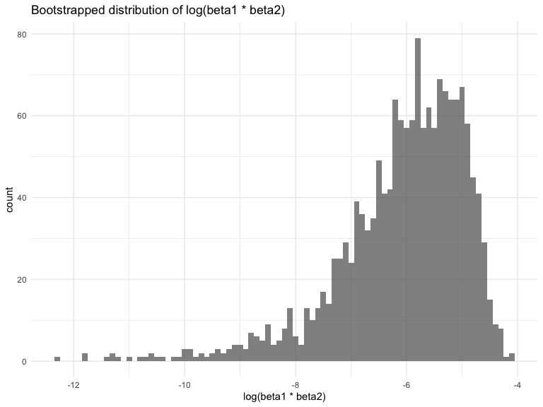
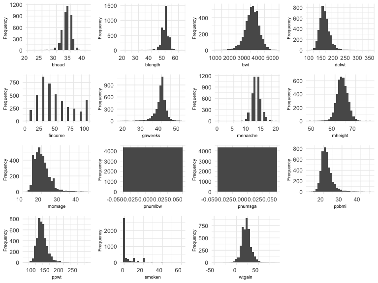
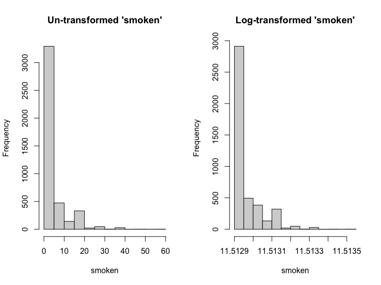
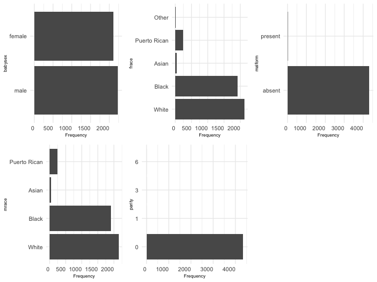
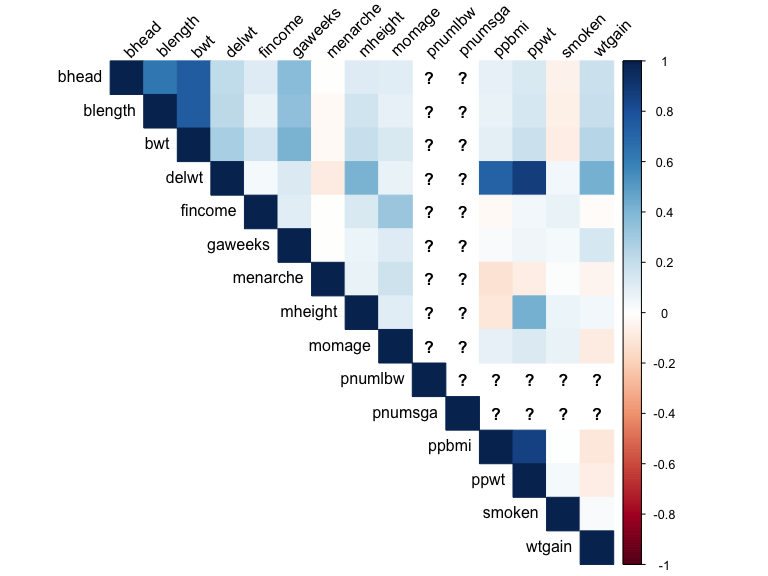
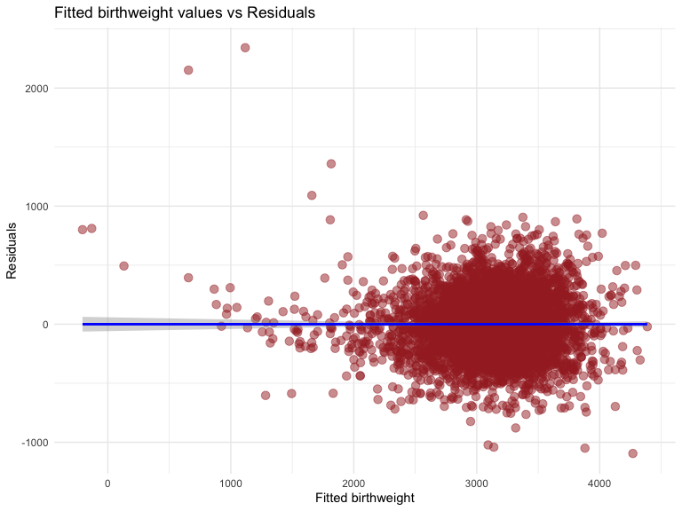
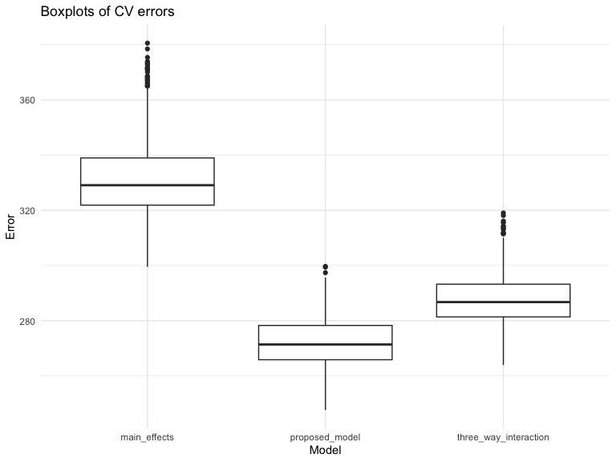
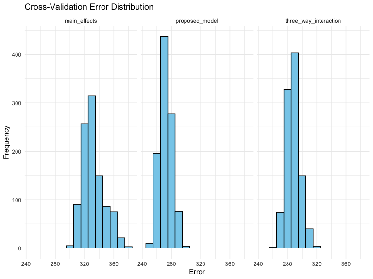

Homework 6
================
Wenwen Li

### Problem 1

In the data cleaning code below we create a `city_state` variable,
change `victim_age` to numeric, modifiy victim_race to have categories
white and non-white, with white as the reference category, and create a
`resolution` variable indicating whether the homicide is solved. Lastly,
we filtered out the following cities: Tulsa, AL; Dallas, TX; Phoenix,
AZ; and Kansas City, MO; and we retained only the variables
`city_state`, `resolution`, `victim_age`, `victim_sex`, and
`victim_race`.

``` r
homicide_df = 
  read_csv("data/homicide-data.csv", na = c("", "NA", "Unknown")) |> 
  mutate(
    city_state = str_c(city, state, sep = ", "),
    victim_age = as.numeric(victim_age),
    resolution = case_when(
      disposition == "Closed without arrest" ~ 0,
      disposition == "Open/No arrest"        ~ 0,
      disposition == "Closed by arrest"      ~ 1)
  ) |> 
  filter(victim_race %in% c("White", "Black")) |> 
  filter(!(city_state %in% c("Tulsa, AL", "Dallas, TX", "Phoenix, AZ", "Kansas City, MO"))) |> 
  select(city_state, resolution, victim_age, victim_sex, victim_race)
```

    ## Rows: 52179 Columns: 12
    ## ── Column specification ────────────────────────────────────────────────────────
    ## Delimiter: ","
    ## chr (8): uid, victim_last, victim_first, victim_race, victim_sex, city, stat...
    ## dbl (4): reported_date, victim_age, lat, lon
    ## 
    ## ℹ Use `spec()` to retrieve the full column specification for this data.
    ## ℹ Specify the column types or set `show_col_types = FALSE` to quiet this message.

Next we fit a logistic regression model using only data from Baltimore,
MD. We model `resolved` as the outcome and `victim_age`, `victim_sex`,
and `victim_race` as predictors. We save the output as `baltimore_glm`
so that we can apply `broom::tidy` to this object and obtain the
estimate and confidence interval of the adjusted odds ratio for solving
homicides comparing non-white victims to white victims.

``` r
baltimore_glm = 
  filter(homicide_df, city_state == "Baltimore, MD") |> 
  glm(resolution ~ victim_age + victim_sex + victim_race, family = binomial(), data = _)

baltimore_glm |> 
  broom::tidy() |> 
  mutate(
    OR = exp(estimate), 
    OR_CI_upper = exp(estimate + 1.96 * std.error),
    OR_CI_lower = exp(estimate - 1.96 * std.error)) |> 
  filter(term == "victim_sexMale") |> 
  select(OR, OR_CI_lower, OR_CI_upper) |>
  knitr::kable(digits = 3)
```

|    OR | OR_CI_lower | OR_CI_upper |
|------:|------------:|------------:|
| 0.426 |       0.325 |       0.558 |

Below, by incorporating `nest()`, `map()`, and `unnest()` into the
preceding Baltimore-specific code, we fit a model for each of the
cities, and extract the adjusted odds ratio (and CI) for solving
homicides comparing non-white victims to white victims. We show the
first 5 rows of the resulting dataframe of model results.

``` r
model_results = 
  homicide_df |> 
  nest(data = -city_state) |> 
  mutate(
    models = map(data, \(df) glm(resolution ~ victim_age + victim_sex + victim_race, 
                             family = binomial(), data = df)),
    tidy_models = map(models, broom::tidy)) |> 
  select(-models, -data) |> 
  unnest(cols = tidy_models) |> 
  mutate(
    OR = exp(estimate), 
    OR_CI_upper = exp(estimate + 1.96 * std.error),
    OR_CI_lower = exp(estimate - 1.96 * std.error)) |> 
  filter(term == "victim_sexMale") |> 
  select(city_state, OR, OR_CI_lower, OR_CI_upper)

model_results |>
  slice(1:5) |> 
  knitr::kable(digits = 3)
```

| city_state      |    OR | OR_CI_lower | OR_CI_upper |
|:----------------|------:|------------:|------------:|
| Albuquerque, NM | 1.767 |       0.831 |       3.761 |
| Atlanta, GA     | 1.000 |       0.684 |       1.463 |
| Baltimore, MD   | 0.426 |       0.325 |       0.558 |
| Baton Rouge, LA | 0.381 |       0.209 |       0.695 |
| Birmingham, AL  | 0.870 |       0.574 |       1.318 |

Below we generate a plot of the estimated ORs and CIs for each city,
ordered by magnitude of the OR from smallest to largest. From this plot
we see that most cities have odds ratios that are smaller than 1,
suggesting that crimes with male victims have smaller odds of resolution
compared to crimes with female victims after adjusting for victim age
and race. This disparity is strongest in New yrok. In roughly half of
these cities, confidence intervals are narrow and do not contain 1,
suggesting a significant difference in resolution rates by sex after
adjustment for victim age and race.

``` r
model_results |> 
  mutate(city_state = fct_reorder(city_state, OR)) |> 
  ggplot(aes(x = city_state, y = OR)) + 
  geom_point() + 
  geom_errorbar(aes(ymin = OR_CI_lower, ymax = OR_CI_upper)) + 
  theme(axis.text.x = element_text(angle = 90, hjust = 1))
```


\### Problem 2 \## Accessing the data

``` r
weather_df = 
  rnoaa::meteo_pull_monitors(
    c("USW00094728"),
    var = c("PRCP", "TMIN", "TMAX"), 
    date_min = "2022-01-01",
    date_max = "2022-12-31") |>
  mutate(
    name = recode(id, USW00094728 = "CentralPark_NY"),
    tmin = tmin / 10,
    tmax = tmax / 10) |>
  select(name, id, everything())
```

    ## using cached file: /Users/liwenwen/Library/Caches/org.R-project.R/R/rnoaa/noaa_ghcnd/USW00094728.dly

    ## date created (size, mb): 2023-11-29 18:20:32.51546 (8.544)

    ## file min/max dates: 1869-01-01 / 2023-11-30

``` r
#function to calculate R-squared and log(beta1 * beta2)
calculate_metrics = function(data) {
  model = lm(tmax ~ tmin + prcp, data = data)
  tidy_results = broom::tidy(model)
  r_squared = broom::glance(model)$r.squared
  #taking the logarithm after converting to absolute values
  beta_product = log(tidy_results$estimate[2]*
                        tidy_results$estimate[3])
  metrics_df = data.frame(R_squared = r_squared,
                           Beta_product = beta_product)
  return(metrics_df)
}

calculate_metrics(weather_df)
```

    ##   R_squared Beta_product
    ## 1 0.9159502          NaN

``` r
#function to extract R-squared and compute log(beta1*beta2) for each bootstrap replicate
calculate_metrics = function(data) {
  data= data.frame(data)
  model = lm(tmax ~ tmin + prcp, data = data)
  tidy_results = broom::tidy(model)
  r_squared = broom::glance(model)$r.squared
  #taking the logarithm of beta1*beta2
  beta_product = log(tidy_results$estimate[2] * tidy_results$estimate[3])
  #return a data frame for the current replicate
  data.frame(R_squared = r_squared, Beta_product = beta_product)
}

#5000 bootstraps using modelr's bootstrap function
boot = modelr::bootstrap(weather_df, 5000)

#use the custom tidying function
models = map(boot$strap, calculate_metrics)

#combine the results into a data frame
bootstrap_results = bind_rows(models, .id = "Replicate")

#view the results
head(bootstrap_results)
```

    ##   Replicate R_squared Beta_product
    ## 1         1 0.9371578          NaN
    ## 2         2 0.9044898    -5.050188
    ## 3         3 0.8923568          NaN
    ## 4         4 0.9155704          NaN
    ## 5         5 0.9358424          NaN
    ## 6         6 0.9348867          NaN

``` r
#visualize bootstrap distribution of R-squared
ggplot(bootstrap_results, aes(x = R_squared)) +
  geom_histogram(binwidth = 0.005, alpha = 0.7) +
  labs(title = "Bootstrapped distribution of R-squared",
       x = "R-squared")
```



The bootstrap distribution of the R-squared metric from the 5000
bootstrap samples assumes a slight left-skewed distribution, from the
shape of the histogram.

``` r
#visualize bootstrap distribution of log(beta1 * beta2)
ggplot(bootstrap_results, aes(x = Beta_product)) +
  geom_histogram(binwidth = 0.1, alpha = 0.7) +
  labs(title = "Bootstrapped distribution of log(beta1 * beta2)",
       x = "log(beta1 * beta2)")
```



The bootstrap distribution of the log(beta1 \* beta2) value from the
5000 bootstrap samples indicates a heavy left-skewed distribution.

``` r
#compute 95% confidence intervals for R-squared and log(beta1*beta2)
confidence_intervals = summarize(bootstrap_results,
  CIlower_R2 = quantile(R_squared, 0.025),
  CIupper_R2 = quantile(R_squared, 0.975),
  CIlower_b1xb2 = quantile(Beta_product, 0.025, na.rm=TRUE),
  CIupper_b1xb2 = quantile(Beta_product, 0.975, na.rm=TRUE)) 

confidence_intervals
```

    ##   CIlower_R2 CIupper_R2 CIlower_b1xb2 CIupper_b1xb2
    ## 1  0.8888229  0.9402667     -9.039741     -4.568909

# Problem 3

## Data Importation and preparation

``` r
#import birthweight data
birthweight_data = read.csv("data/birthweight.csv")
#display the structure of the dataset
str(birthweight_data)
```

    ## 'data.frame':    4342 obs. of  20 variables:
    ##  $ babysex : int  2 1 2 1 2 1 2 2 1 1 ...
    ##  $ bhead   : int  34 34 36 34 34 33 33 33 36 33 ...
    ##  $ blength : int  51 48 50 52 52 52 46 49 52 50 ...
    ##  $ bwt     : int  3629 3062 3345 3062 3374 3374 2523 2778 3515 3459 ...
    ##  $ delwt   : int  177 156 148 157 156 129 126 140 146 169 ...
    ##  $ fincome : int  35 65 85 55 5 55 96 5 85 75 ...
    ##  $ frace   : int  1 2 1 1 1 1 2 1 1 2 ...
    ##  $ gaweeks : num  39.9 25.9 39.9 40 41.6 ...
    ##  $ malform : int  0 0 0 0 0 0 0 0 0 0 ...
    ##  $ menarche: int  13 14 12 14 13 12 14 12 11 12 ...
    ##  $ mheight : int  63 65 64 64 66 66 72 62 61 64 ...
    ##  $ momage  : int  36 25 29 18 20 23 29 19 13 19 ...
    ##  $ mrace   : int  1 2 1 1 1 1 2 1 1 2 ...
    ##  $ parity  : int  3 0 0 0 0 0 0 0 0 0 ...
    ##  $ pnumlbw : int  0 0 0 0 0 0 0 0 0 0 ...
    ##  $ pnumsga : int  0 0 0 0 0 0 0 0 0 0 ...
    ##  $ ppbmi   : num  26.3 21.3 23.6 21.8 21 ...
    ##  $ ppwt    : int  148 128 137 127 130 115 105 119 105 145 ...
    ##  $ smoken  : num  0 0 1 10 1 0 0 0 0 4 ...
    ##  $ wtgain  : int  29 28 11 30 26 14 21 21 41 24 ...

``` r
#check for missing data
sum(is.na(birthweight_data))
```

    ## [1] 0

The baby birth weight dataset doesn’t have missing values.

``` r
#convert variables to appropriate data dtypes
birthweight_data$babysex = factor(birthweight_data$babysex,
                                   levels = c(1, 2),
                                   labels = c("male", "female"))
birthweight_data$frace = factor(birthweight_data$frace,
                                 levels = c(1, 2, 3, 4, 8, 9), 
                                  labels = c("White", "Black", "Asian",
                                             "Puerto Rican", "Other",
                                             "Unknown"))
birthweight_data$mrace = factor(birthweight_data$mrace,
                                 levels = c(1, 2, 3, 4, 8, 9), 
                                  labels = c("White", "Black", "Asian",
                                             "Puerto Rican", "Other",
                                             "Unknown"))
birthweight_data$malform = factor(birthweight_data$malform,
                                   levels = c(0, 1),
                                   labels = c("absent", "present"))
birthweight_data$parity = as.factor(birthweight_data$parity)

#check the structure of the dataset after conversion
str(birthweight_data)
```

    ## 'data.frame':    4342 obs. of  20 variables:
    ##  $ babysex : Factor w/ 2 levels "male","female": 2 1 2 1 2 1 2 2 1 1 ...
    ##  $ bhead   : int  34 34 36 34 34 33 33 33 36 33 ...
    ##  $ blength : int  51 48 50 52 52 52 46 49 52 50 ...
    ##  $ bwt     : int  3629 3062 3345 3062 3374 3374 2523 2778 3515 3459 ...
    ##  $ delwt   : int  177 156 148 157 156 129 126 140 146 169 ...
    ##  $ fincome : int  35 65 85 55 5 55 96 5 85 75 ...
    ##  $ frace   : Factor w/ 6 levels "White","Black",..: 1 2 1 1 1 1 2 1 1 2 ...
    ##  $ gaweeks : num  39.9 25.9 39.9 40 41.6 ...
    ##  $ malform : Factor w/ 2 levels "absent","present": 1 1 1 1 1 1 1 1 1 1 ...
    ##  $ menarche: int  13 14 12 14 13 12 14 12 11 12 ...
    ##  $ mheight : int  63 65 64 64 66 66 72 62 61 64 ...
    ##  $ momage  : int  36 25 29 18 20 23 29 19 13 19 ...
    ##  $ mrace   : Factor w/ 6 levels "White","Black",..: 1 2 1 1 1 1 2 1 1 2 ...
    ##  $ parity  : Factor w/ 4 levels "0","1","3","6": 3 1 1 1 1 1 1 1 1 1 ...
    ##  $ pnumlbw : int  0 0 0 0 0 0 0 0 0 0 ...
    ##  $ pnumsga : int  0 0 0 0 0 0 0 0 0 0 ...
    ##  $ ppbmi   : num  26.3 21.3 23.6 21.8 21 ...
    ##  $ ppwt    : int  148 128 137 127 130 115 105 119 105 145 ...
    ##  $ smoken  : num  0 0 1 10 1 0 0 0 0 4 ...
    ##  $ wtgain  : int  29 28 11 30 26 14 21 21 41 24 ...

## Data driven model building.

The response variable in this study is the ‘bwt’, which indicates a new
born baby’s weight in grams.

To decide on the best features to use in a predictive model, we first
explore the statistical properties of all numerical and categorical
variables.

``` r
#descriptive statistics of birthweight data
summary(birthweight_data)
```

    ##    babysex         bhead          blength           bwt           delwt      
    ##  male  :2230   Min.   :21.00   Min.   :20.00   Min.   : 595   Min.   : 86.0  
    ##  female:2112   1st Qu.:33.00   1st Qu.:48.00   1st Qu.:2807   1st Qu.:131.0  
    ##                Median :34.00   Median :50.00   Median :3132   Median :143.0  
    ##                Mean   :33.65   Mean   :49.75   Mean   :3114   Mean   :145.6  
    ##                3rd Qu.:35.00   3rd Qu.:51.00   3rd Qu.:3459   3rd Qu.:157.0  
    ##                Max.   :41.00   Max.   :63.00   Max.   :4791   Max.   :334.0  
    ##     fincome               frace         gaweeks         malform    
    ##  Min.   : 0.00   White       :2123   Min.   :17.70   absent :4327  
    ##  1st Qu.:25.00   Black       :1911   1st Qu.:38.30   present:  15  
    ##  Median :35.00   Asian       :  46   Median :39.90                 
    ##  Mean   :44.11   Puerto Rican: 248   Mean   :39.43                 
    ##  3rd Qu.:65.00   Other       :  14   3rd Qu.:41.10                 
    ##  Max.   :96.00   Unknown     :   0   Max.   :51.30                 
    ##     menarche        mheight          momage              mrace      parity  
    ##  Min.   : 0.00   Min.   :48.00   Min.   :12.0   White       :2147   0:4339  
    ##  1st Qu.:12.00   1st Qu.:62.00   1st Qu.:18.0   Black       :1909   1:   1  
    ##  Median :12.00   Median :63.00   Median :20.0   Asian       :  43   3:   1  
    ##  Mean   :12.51   Mean   :63.49   Mean   :20.3   Puerto Rican: 243   6:   1  
    ##  3rd Qu.:13.00   3rd Qu.:65.00   3rd Qu.:22.0   Other       :   0           
    ##  Max.   :19.00   Max.   :77.00   Max.   :44.0   Unknown     :   0           
    ##     pnumlbw     pnumsga      ppbmi            ppwt           smoken      
    ##  Min.   :0   Min.   :0   Min.   :13.07   Min.   : 70.0   Min.   : 0.000  
    ##  1st Qu.:0   1st Qu.:0   1st Qu.:19.53   1st Qu.:110.0   1st Qu.: 0.000  
    ##  Median :0   Median :0   Median :21.03   Median :120.0   Median : 0.000  
    ##  Mean   :0   Mean   :0   Mean   :21.57   Mean   :123.5   Mean   : 4.145  
    ##  3rd Qu.:0   3rd Qu.:0   3rd Qu.:22.91   3rd Qu.:134.0   3rd Qu.: 5.000  
    ##  Max.   :0   Max.   :0   Max.   :46.10   Max.   :287.0   Max.   :60.000  
    ##      wtgain      
    ##  Min.   :-46.00  
    ##  1st Qu.: 15.00  
    ##  Median : 22.00  
    ##  Mean   : 22.08  
    ##  3rd Qu.: 28.00  
    ##  Max.   : 89.00

The descriptive statistics depict an almost equal number of babies from
both sexes, with male babies having the slightly higher number.  
Some variables such as `pnumlbw` and `pnumsga` appear to have constant
values.

### Histograms of all numerical variables.

``` r
#select only numerical variables
numerical_vars = birthweight_data[, sapply(birthweight_data,
                                            is.numeric)]
#plot histograms for all numerical variables
plot_histograms = function(dataset) {
  #get the number of rows and columns needed for the plots
  ncol = 4
  nrow = 4

  #create a histogram for each variable and store in a list
  hist_list = lapply(names(dataset), function(x) {
    ggplot(dataset, aes(x = .data[[x]])) +
      geom_histogram() + 
      labs(y="Frequency",
           x= x)+
      theme(axis.title = element_text(size = 7),
            axis.text.x = element_text(hjust = 1))
  })

  #visualize the histograms using grid layout
  grid.arrange(grobs = hist_list, ncol = ncol, nrow = nrow)
}
plot_histograms(numerical_vars)
```

 -
From the histograms, only the `smoken` appears significantly skewed (to
the right). A log transformation was applied to reduce the skewness and
the results re-visualized. The histograms of the `pnumlbw` and `pnumsga`
confirm the suspicions for zero-variance variables.

``` r
#log transform smoken; make a small addition to avoid infinity values
birthweight_data$smoken = log(birthweight_data$smoken+1e5)
par(mfrow=c(1,2))
hist(numerical_vars$smoken,
     xlab = "smoken",
     main="Un-transformed 'smoken'")
hist(birthweight_data$smoken,
     xlab = "smoken",
     main="Log-transformed 'smoken'")
```


The histograms above show a comparison between the skewness in the
un-transformed and log-transformed `smoken` variable, with the latter
showing a smaller spread and thus smaller effect of skewness in the
modeling to be carried out.  
\### Barplots of all categorical variables.

``` r
#select only categorical variables
categ_vars = birthweight_data[, sapply(birthweight_data,
                                            is.factor)]
#plot barplots for all factor variables
plot_barplots = function(dataset) {
  #get the number of rows and columns needed for the plots
  ncol = 3
  nrow = 2

  #create a barplot for each variable and store in a list
  hist_list = lapply(names(dataset), function(x) {
    ggplot(dataset, aes(x = .data[[x]])) +
      geom_bar() + 
      labs(y="Frequency",
           x= x)+
      coord_flip()+
      theme(axis.title = element_text(size = 7),
            axis.text.x = element_text(hjust = 1))
  })

  #visualize the barplots using grid layout
  grid.arrange(grobs = hist_list, ncol = ncol, nrow = nrow)
}
plot_barplots(categ_vars)
```


Some categorical variables, `malform` and `parity` in particular, have
heavy class imbalances, and may thus contribute little to no explnatory
power of the variation in birthweight of babies.

### Correlation analysis

``` r
#calculate the correlation matrix
cor_matrix = cor(numerical_vars, method = "pearson")

#create a heatmap for correlation visualization
corrplot(cor_matrix, method = "color",
         type = "upper", tl.col = "black",
         tl.srt = 45, hclust.method="complete")
```


The response variable `bwt` indicates weak to moderate positive and
negative correlations with all the numerical variables. Notably, the
response variable has a weak negative correlation with the `smoken`
variable. The `ppbmi`, `ppwt`, and the `delwt` variables appear to have
high correlations. They are all descriptive of a mother’s weight for
either before or after delivery. It might not be necessary to include
all of them. For instance, the `ppbmi` is a direct derivative of the
`ppwt`, and therefore the two are expected to be positively
correlated.  
\### Near zero variance/ Zero variance variables.

Zero-variance variables are features in a dataset that do not add
explanatory power to the observed variation in a dataset with respect to
the response variable.

``` r
nzv = nearZeroVar(birthweight_data, saveMetrics= TRUE)
#number of variables with near zero variance
nzv |> filter(nzv == TRUE) |> nrow()
```

    ## [1] 4

``` r
#removing near zero variance variables
birthweight_data = birthweight_data [, !nzv$nzv]
```

Four variables were found to have zero or near zero variance, and were
excluded from the data set. These included the `malform`, `parity`,
`pnulbw`, and `pnumsga`. \### Multicollinearity.

Highly correlated variables could cause multicollinearity, which could
make it difficult to estimate the effects of individual features on the
response variable.

## Multiple linear regression modeling.

A total of 14 variables, including; babysex, bhead, blength, delwt,
fincome, frace, gaweeks, menarche, mheight, momage, mrace, ppwt, and
smoken were selected for the linear model building.

``` r
#multiple linear regression model
lm_model = lm(bwt ~ babysex + bhead + blength + delwt + fincome + frace +
                 gaweeks + menarche + mheight + momage + mrace +
                 ppwt + smoken, data = birthweight_data)
#display a summary of the model
summary(lm_model)
```

    ## 
    ## Call:
    ## lm(formula = bwt ~ babysex + bhead + blength + delwt + fincome + 
    ##     frace + gaweeks + menarche + mheight + momage + mrace + ppwt + 
    ##     smoken, data = birthweight_data)
    ## 
    ## Residuals:
    ##      Min       1Q   Median       3Q      Max 
    ## -1094.67  -184.82    -3.77   173.70  2341.61 
    ## 
    ## Coefficients:
    ##                     Estimate Std. Error t value Pr(>|t|)    
    ## (Intercept)        5.590e+06  6.759e+05   8.269  < 2e-16 ***
    ## babysexfemale      2.926e+01  8.463e+00   3.458 0.000549 ***
    ## bhead              1.310e+02  3.451e+00  37.946  < 2e-16 ***
    ## blength            7.489e+01  2.022e+00  37.041  < 2e-16 ***
    ## delwt              4.129e+00  3.945e-01  10.466  < 2e-16 ***
    ## fincome            2.753e-01  1.794e-01   1.534 0.124987    
    ## fraceBlack         1.444e+01  4.616e+01   0.313 0.754403    
    ## fraceAsian         2.047e+01  6.932e+01   0.295 0.767748    
    ## fracePuerto Rican -4.747e+01  4.469e+01  -1.062 0.288241    
    ## fraceOther         4.386e+00  7.409e+01   0.059 0.952798    
    ## gaweeks            1.126e+01  1.461e+00   7.709 1.56e-14 ***
    ## menarche          -3.528e+00  2.895e+00  -1.219 0.223022    
    ## mheight            6.769e+00  1.801e+00   3.758 0.000173 ***
    ## momage             9.797e-01  1.219e+00   0.804 0.421550    
    ## mraceBlack        -1.514e+02  4.606e+01  -3.288 0.001018 ** 
    ## mraceAsian        -9.276e+01  7.191e+01  -1.290 0.197133    
    ## mracePuerto Rican -5.682e+01  4.515e+01  -1.259 0.208237    
    ## ppwt              -2.753e+00  4.327e-01  -6.361 2.21e-10 ***
    ## smoken            -4.860e+05  5.871e+04  -8.278  < 2e-16 ***
    ## ---
    ## Signif. codes:  0 '***' 0.001 '**' 0.01 '*' 0.05 '.' 0.1 ' ' 1
    ## 
    ## Residual standard error: 272.6 on 4323 degrees of freedom
    ## Multiple R-squared:  0.718,  Adjusted R-squared:  0.7168 
    ## F-statistic: 611.4 on 18 and 4323 DF,  p-value: < 2.2e-16

       ### Fitted vs. Residual plot.      

``` r
#add predictions from the linear model
preds_resid_df = add_predictions(birthweight_data, lm_model, var = "pred")
#add residuals from the lienar model
preds_resid_df = add_residuals(preds_resid_df, lm_model, var="resid")


ggplot(preds_resid_df, aes(x = pred, y = resid)) +
  geom_point(color = "brown", size = 3, alpha=0.5) +
  geom_smooth(method = "lm", color = "blue") +
  labs(title = "Fitted birthweight values vs Residuals",
       x = "Fitted birthweight", 
       y = "Residuals")
```



There isn’t a clear pattern, trend, or shape in the plot of the fitted
values versus the residuals of the multiple linear regression model. The
residuals from the fitted linear model do not depict a significant
deviation from the expectation of homoscedasticity which is; the spread
or dispersion of residuals should be relatively constant across all
levels of fitted values.  
There isn’t a clear pattern, trend, or shape in the plot of the fitted
values versus the residuals of the multiple linear regression model. The
residuals from the fitted linear model do not depict a significant
deviation from the expectation of homoscedasticity which is; the spread
or dispersion of residuals should be relatively constant across all
levels of fitted values.

## Model comparison.

``` r
#alternative model 1 using length at birth and gestational age as predictors 
model1 = lm(bwt ~ blength + gaweeks, data = birthweight_data)
summary(model1)
```

    ## 
    ## Call:
    ## lm(formula = bwt ~ blength + gaweeks, data = birthweight_data)
    ## 
    ## Residuals:
    ##     Min      1Q  Median      3Q     Max 
    ## -1709.6  -215.4   -11.4   208.2  4188.8 
    ## 
    ## Coefficients:
    ##              Estimate Std. Error t value Pr(>|t|)    
    ## (Intercept) -4347.667     97.958  -44.38   <2e-16 ***
    ## blength       128.556      1.990   64.60   <2e-16 ***
    ## gaweeks        27.047      1.718   15.74   <2e-16 ***
    ## ---
    ## Signif. codes:  0 '***' 0.001 '**' 0.01 '*' 0.05 '.' 0.1 ' ' 1
    ## 
    ## Residual standard error: 333.2 on 4339 degrees of freedom
    ## Multiple R-squared:  0.5769, Adjusted R-squared:  0.5767 
    ## F-statistic:  2958 on 2 and 4339 DF,  p-value: < 2.2e-16

``` r
#alternative model 2 using head circumference, length, sex, and all their interactions
model2 = lm(bwt ~ bhead * blength * babysex, data = birthweight_data)
summary(model2)
```

    ## 
    ## Call:
    ## lm(formula = bwt ~ bhead * blength * babysex, data = birthweight_data)
    ## 
    ## Residuals:
    ##      Min       1Q   Median       3Q      Max 
    ## -1132.99  -190.42   -10.33   178.63  2617.96 
    ## 
    ## Coefficients:
    ##                               Estimate Std. Error t value Pr(>|t|)    
    ## (Intercept)                 -7176.8170  1264.8397  -5.674 1.49e-08 ***
    ## bhead                         181.7956    38.0542   4.777 1.84e-06 ***
    ## blength                       102.1269    26.2118   3.896 9.92e-05 ***
    ## babysexfemale                6374.8684  1677.7669   3.800 0.000147 ***
    ## bhead:blength                  -0.5536     0.7802  -0.710 0.478012    
    ## bhead:babysexfemale          -198.3932    51.0917  -3.883 0.000105 ***
    ## blength:babysexfemale        -123.7729    35.1185  -3.524 0.000429 ***
    ## bhead:blength:babysexfemale     3.8781     1.0566   3.670 0.000245 ***
    ## ---
    ## Signif. codes:  0 '***' 0.001 '**' 0.01 '*' 0.05 '.' 0.1 ' ' 1
    ## 
    ## Residual standard error: 287.7 on 4334 degrees of freedom
    ## Multiple R-squared:  0.6849, Adjusted R-squared:  0.6844 
    ## F-statistic:  1346 on 7 and 4334 DF,  p-value: < 2.2e-16

The alternative models have lower adjusted R-squared values compared to
the proposed linear model.

``` r
#list of models
models = list(lm_model, model1, model2)

#function to calculate prediction errors for a single model
calculate_errors = function(model, train_data, test_data) {
  #add predictions to the test set
  predictions_df = add_predictions(test_data, model, var = "pred")
  #add residuals to the predictions
  predictions_df = add_residuals(predictions_df, model, var = "resid")
  #calculate RMSE (Root Mean Squared Error)
  rmse = sqrt(mean(predictions_df$resid^2))
  return(rmse)
}

#function to perform 1000 cross-validations and calculate errors for each model
crossval_model = function(model) {
  #create a cross-validation object
  cv_results = crossv_mc(birthweight_data, n = 1000)
  #calculate prediction errors for each fold
  errors = map2_dbl(cv_results$train, cv_results$test, calculate_errors, model = model)
  #return the errors
  return(errors)
}

#apply the cross-validation function to each model
errors_list = map(models, crossval_model)

#model descriptions
model_names = c("proposed_model","main_effects","three_way_interaction")

#create a data frame with model names as columns
errors_df = as.data.frame(setNames(errors_list, model_names))

#view the resulting data frame
head(errors_df)
```

    ##   proposed_model main_effects three_way_interaction
    ## 1       265.6775     329.5886              268.1767
    ## 2       284.5910     333.4112              286.7422
    ## 3       263.8719     326.9486              291.2067
    ## 4       271.2746     344.2288              274.3624
    ## 5       263.4053     360.8447              288.9971
    ## 6       273.9699     350.5386              290.1472

### Mean Cross validated RMSE.

``` r
#mean CV error Comparison
errors_df |>
  summarise_all(mean)
```

    ##   proposed_model main_effects three_way_interaction
    ## 1       272.2691     331.8574              287.5619

Proposed model achieves the lowest cross validated error of the three
models. The three way interaction model using head circumference,
length, and sex of the babies is the second best predictive model even
though it uses just 3 variables (and their interactions) of the 14
applied in the proposed model.

### Boxplots of cross-validated errors.

``` r
#boxplot of Errors
errors_df |>
  gather(key = "Model", value = "Error") |>
  ggplot(aes(x = Model, y = Error)) +
  geom_boxplot() +
  labs(title = "Boxplots of CV errors", x = "Model", y = "Error")
```



All the three models show outliers in the cross-validated errors.

### Histograms of CV errors.

``` r
#Cross-Validation Error distribution
errors_df |>
  gather(key = "Model", value = "Error") |>
  ggplot(aes(x = Error)) +
  facet_wrap(~Model)+
  geom_histogram(binwidth = 10, fill = "skyblue", color = "black") +
  labs(title = "Cross-Validation Error Distribution", x = "Error", y = "Frequency")
```



The CV error histograms ofthe models show deviations from the normal
distribution.
